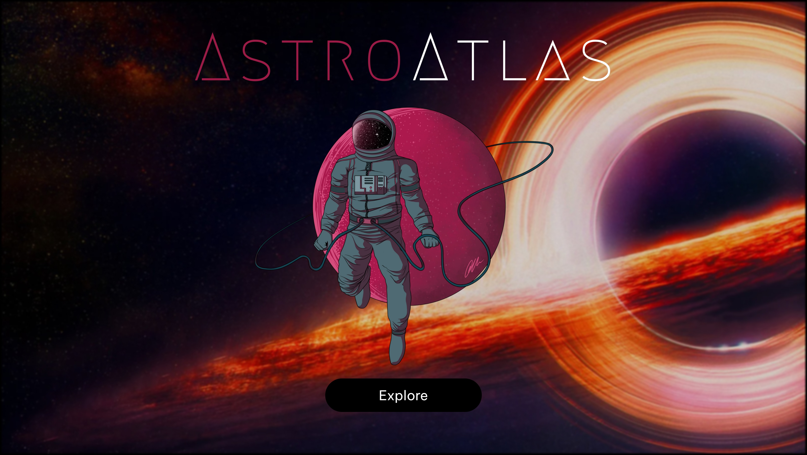
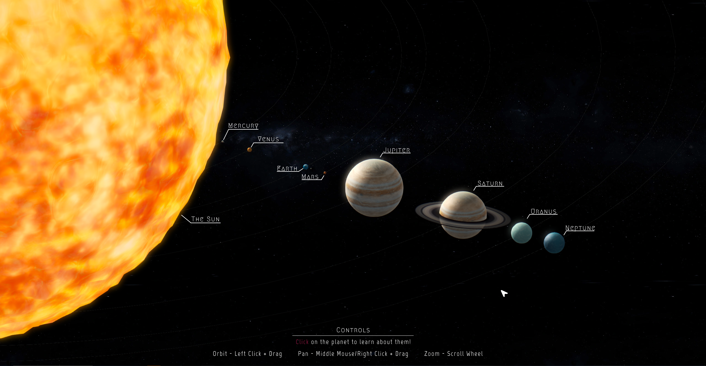
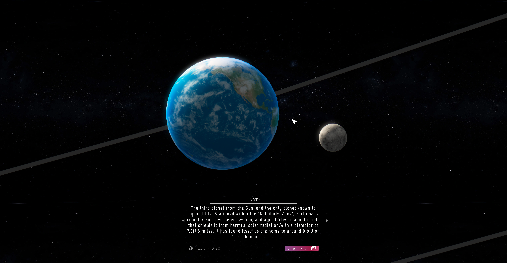
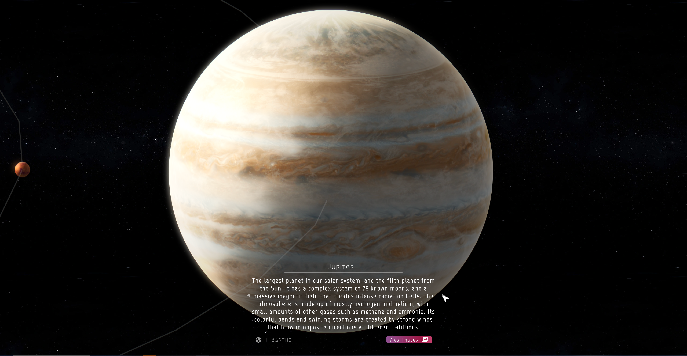
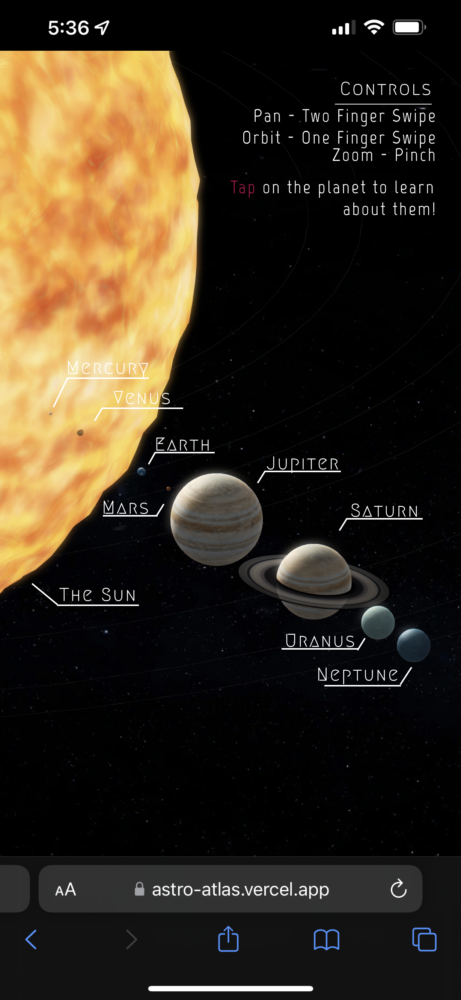

  # AstroAtlas [WayneHacks 2023 - 3rd Place Hackathon Project]

Explore the solar system in 3D! Discover planets and moons with immersive animations and detailed information. An educational experience for all.

[Visit The Demo](https://astro-atlas.vercel.app/)

##
### Inspiration
We were inspired by NASA's 3d model of the solar system and wanted to take a similar approach. However, NASA's version is filled with a lot of information and is meant for more hard-core space enthusiasts. We wanted to create a more user-friendly and casual interactive website that would educate people about interesting things about Astronomy.

### What it does
AstroAtlas provides an engaging and informative way to learn about the solar system. It allows users to explore the planets and moons in a realistic 3d environment, with immersive animations that simulate space travel. Users can access detailed information about each celestial body, including its size, composition, and orbit. The website is designed to be both fun and educational, catering to space enthusiasts, students, and anyone who is curious about the universe.

### Built With
Spline, Three.js, Next.js, React.js, TailwindCSS. Deployed on Vercel
